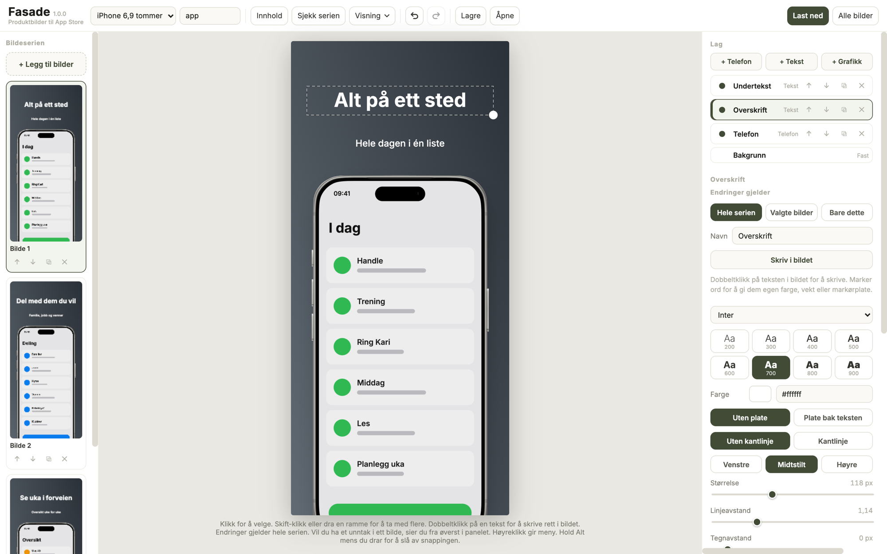

# Fasade

Lag produktbilder til App Store i nettleseren: En hel serie med telefonramme,
tekst og sømløse overganger, i størrelsene App Store krever.

**[Åpne Fasade](https://elzacka.github.io/fasade/)**, eller kjør `fasade.html`
lokalt på Mac eller PC.



| | |
| --- | --- |
| **Bruk** | [Brukerveiledning](brukerveiledning.md) |
| **Utvikling** | Ingen byggesteg og ingenting å installere. Rediger `fasade.html` og last siden på nytt |
| **Versjon** | [Semantisk versjonering](https://semver.org/): `MAJOR.MINOR.PATCH`, i `VERSJON` i `fasade.html` og som git-tagg `vX.Y.Z` |
| **Lisens** | MIT, se [LICENSE](LICENSE). Skriftene i `assets/fonts/` har egne OFL-lisenser |

## Filer

| Fil eller mappe | Innhold |
| --- | --- |
| `fasade.html` | Hele verktøyet: CSS, markup og JavaScript |
| `index.html` | Sender GitHub Pages videre til `fasade.html` |
| `.nojekyll` | Får GitHub Pages til å levere filene som de er |
| `assets/fonts/` | Exo 2 og Skranji. De andre skriftene kommer fra Google Fonts |
| `assets/mockups/` | Kilde-SVG-ene for telefonrammene. De er integrert i verktøyet |
| `assets/screenshot.png` | Skjermbildet over |

## Slik virker koden

| Område | I koden | Slik virker det |
| --- | --- | --- |
| Tilstand | `state.prosjekt`, `bilder` | Prosjektet peker på bilder med id. Selve bildene ligger i `bilder` som data-URL |
| Lagring | IndexedDB `asc-produktbilder`, localStorage `asc-*` | Prosjektet i IndexedDB, visningsvalg i localStorage |
| Mal | `prosjekt.mal.roller`, `rolleId`, `avvik`, `skrivTilMal` | Rollen holder utseendet. `skrivTilMal` skriver til rollen og søskenlagene og hopper over felt i `avvik`. Feltene i `LOKALE_FELT` er innhold og speiles aldri |
| Innlesing | `normaliserProsjekt`, `byggMalFraProsjekt`, `tilVersjon4` | Fyller inn manglende felt. Et prosjekt uten mal får en, med første bilde som fasit. Et prosjekt fra versjon 3 eller eldre får telefonstørrelsene regnet om, så hver telefon beholder størrelsen den hadde |
| Serien | `steget()`, `spenn` | Steget er bildebredde + mellomrom. Et lag med `spenn` tegnes også i nabobildet, forskjøvet med steget |
| Tilsvarende lag | `finnTilsvarende` | Finner samme lag i et annet bilde, først på navn, så på type og plass |
| Tekst | `tekstOppsett`, `#tekstinn`, `uthev` | Ett oppsett for tegning, klikk, markør og markering. Skrivingen går gjennom et skjult felt |
| 3D | `lagKontur`, `byggKropp`, WebGL | Silhuetten leses ut av sølvrammen. `byggKropp` bygger kroppen i millimeter rundt silhuetten, etter målene Apple oppgir til tilbehørsprodusenter: Kantprofil, knapper og kameraplatå. Shaderen tegner USB-C-porten, hullene og Camera Control i sideveggen. Rammetegningen dekker bare glasset |
| Modell | `MODELLER`, `teksturFor` | iPhone 17 Pro og 18 Pro har samme kropp. For 18 Pro dekker `teksturFor` Dynamic Island i rammetegningen med skjermbildet og tegner en smalere oppå. Kameraplatået er dypere, og hullene i bunnen er større |
| Rammefarger | `RAMMEDATA`, `VARIANTER` | Tre ekte rammer. De seks andre farges fra sølv med duotone |
| Statuslinje | `analyserStatuslinje`, `skjermbildeMedStatuslinje` | Statuslinjen er de første radene som skiller seg fra fargen øverst. «Skjul» fyller dem med den fargen. «Bytt ut» løfter tegnene av bakgrunnen i et annet skjermbilde med samme størrelse (farge til alfa) og legger dem på bakgrunnen i dette |
| Eksport | `eksporterEn`, `EKSPORTGRUNN` | Ugjennomsiktig canvas, så PNG-ene får ingen alfakanal |
| Sjekk | `publiseringssjekk()` | Gir funnene «Sjekk serien» viser |
| Konsoll | `window.app` | Tilgang til tilstanden. `app.leggTilFraUrl(url)` legger til et bilde |

## Vedlikehold

- **Ny versjon**: Øk `VERSJON` i `fasade.html`, commit og tagg commiten `vX.Y.Z`.

  | Del | Økes når |
  | --- | --- |
  | MAJOR | Endringen gjør lagrede prosjekter eller prosjektfiler uleselige |
  | MINOR | Verktøyet får en ny funksjon |
  | PATCH | En feil er rettet |
- **Endre en ramme**: Rediger SVG-en i `assets/mockups/`, bak den inn på nytt i
  `RAMMEDATA` og sjekk at `lagKontur` fortsatt finner silhuetten:

  ```sh
  python3 -c "import base64;print(base64.b64encode(open('assets/mockups/iphone17-pro-silver-frame.svg','rb').read()).decode())"
  ```
- **Skrift i grensesnittet**: `body`-regelen i `fasade.html`.
- **Endringen vises ikke**: Last siden på nytt med tømt hurtiglager.
